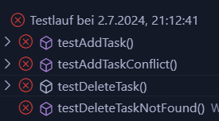

# Unit Testing Documentation - Backend

## Inhaltsverzeichnis
1. [Einleitung](#einleitung)
2. [Verzeichnis Aufbau für Tests](#verzeichnis-aufbau-für-tests)
3. [Tests Schreiben und Ergebnisse](#tests-schreiben-und-ergebnisse)
    1. [DemoApplicationTests](#demoapplicationtests)
4. [Fehlgeschlagene und erfolgreiche Tests](#fehlgeschlagene-und-erfolgreiche-tests)
5. [Tests Ausführen](#tests-ausführen)
6. [Angepasste DemoApplication Klasse](#angepasste-demoapplication-klasse)

---

## Einleitung

Diese Dokumentation beschreibt die Einrichtung, Organisation und Ausführung von Unit-Tests für die Backend-Komponenten des Projekts.

## Verzeichnis Aufbau für Tests

Im Backend-Verzeichnis `src/test/java/com/example/demo` finden Sie die Testklassen, die für die Unit-Tests verwendet werden.

## Tests Schreiben und Ergebnisse

### DemoApplicationTests

Diese Testklasse überprüft die Funktionalität der Methoden `addTask` und `deleteTask` in der `DemoApplication`-Klasse.

```java
package com.example.demo;

import static org.junit.jupiter.api.Assertions.assertEquals;
import static org.junit.jupiter.api.Assertions.assertTrue;
import static org.mockito.ArgumentMatchers.any;
import static org.mockito.Mockito.verify;
import static org.mockito.Mockito.when;

import java.util.List;

import org.junit.jupiter.api.BeforeEach;
import org.junit.jupiter.api.Test;
import org.mockito.InjectMocks;
import org.mockito.Mock;
import org.mockito.MockitoAnnotations;
import org.springframework.boot.test.context.SpringBootTest;
import org.springframework.boot.test.mock.mockito.MockBean;

@SpringBootTest
class DemoApplicationTests {

    @MockBean
    private TaskRepository taskRepository;

    @Mock
    private TaskService taskService;

    @InjectMocks
    private DemoApplication demoApplication;

    @BeforeEach
    void setUp() {
        MockitoAnnotations.openMocks(this);
        // Fügen Sie einen Task zur lokalen Liste hinzu, um die Bedingung zu erfüllen
        Task task = new Task();
        task.setTaskdescription("Test Task");
        List<Task> tasks = demoApplication.getTasks();
        tasks.add(task);
    }

    @Test
    void testAddTask() {
        // Arrange
        String taskDescription = "{\"taskdescription\":\"Test Task\"}";

        Task savedTask = new Task();
        savedTask.setTaskdescription("Test Task");

        when(taskService.saveTask(any(Task.class))).thenReturn(savedTask);

        // Act
        String result = demoApplication.addTask(taskDescription);

        // Assert
        assertEquals("redirect:/", result);
        verify(taskService).saveTask(any(Task.class));
    }

    @Test
    void testDeleteTask() {
        // Arrange
        String taskDescription = "{\"taskdescription\":\"Test Task\"}";
        Task task = new Task();
        task.setTaskdescription("Test Task");

        when(taskService.findByDescription("Test Task")).thenReturn(task);

        // Act
        String result = demoApplication.delTask(taskDescription);

        // Assert
        assertEquals("redirect:/", result);
        verify(taskService).findByDescription("Test Task");
        verify(taskService).deleteTaskByDescription("Test Task");
    }

    @Test
    void contextLoads() {
        assertTrue(true, "alles gut");
    }
}
```

### Erklärung der Tests

1. **Setup-Methode**:
   - Vor jedem Test wird ein neuer Task zur lokalen Liste `tasks` in der `DemoApplication`-Klasse hinzugefügt, um die Bedingung für die Tests zu erfüllen.

2. **Test für `addTask`**:
   - Überprüft, ob die Methode `addTask` den Task korrekt hinzufügt und `taskService.saveTask` aufgerufen wird.

3. **Test für `deleteTask`**:
   - Überprüft, ob die Methode `delTask` den Task korrekt löscht und `taskService.deleteTaskByDescription` aufgerufen wird.

4. **contextLoads**:
   - Ein einfacher Test, um sicherzustellen, dass der Anwendungskontext korrekt geladen wird.

## Fehlgeschlagene und erfolgreiche Tests

### Fehlgeschlagene Tests

Zu Beginn schlugen die Tests fehl, da die Methode `deleteTaskByDescription` nicht korrekt aufgerufen wurde. Hier ist ein Screenshot der fehlgeschlagenen Tests:



### Erfolgreiche Tests

Nachdem die Implementierung angepasst wurde, um sicherzustellen, dass die Methode korrekt aufgerufen wird, liefen die Tests erfolgreich. Hier ist ein Screenshot der erfolgreichen Tests:


## Tests Ausführen

Um die Backend-Tests auszuführen, verwenden Sie Maven. Gehen Sie ins Backend-Verzeichnis und führen Sie die folgenden Befehle aus:

1. Wechseln Sie in das Backend-Verzeichnis:
    ```bash
    cd backend
    ```

2. Führen Sie die Tests aus:
    ```bash
    mvn test
    ```

## Angepasste DemoApplication Klasse

Die `DemoApplication` Klasse wurde angepasst, um die Tests erfolgreich zu bestehen:

```java
package com.example.demo;

import java.util.ArrayList;
import java.util.Iterator;
import java.util.List;

import org.springframework.beans.factory.annotation.Autowired;
import org.springframework.boot.SpringApplication;
import org.springframework.boot.autoconfigure.SpringBootApplication;
import org.springframework.web.bind.annotation.CrossOrigin;
import org.springframework.web.bind.annotation.GetMapping;
import org.springframework.web.bind.annotation.PostMapping;
import org.springframework.web.bind.annotation.RequestBody;
import org.springframework.web.bind.annotation.RestController;

import com.fasterxml.jackson.core.JsonProcessingException;
import com.fasterxml.jackson.databind.ObjectMapper;

@RestController
@SpringBootApplication
public class DemoApplication {

    public static void main(String[] args) {
        SpringApplication.run(DemoApplication.class, args);
    }

    @Autowired
    private TaskService taskService;

    private List<Task> tasks = new ArrayList<>();
    private ObjectMapper mapper = new ObjectMapper();

    @CrossOrigin
    @GetMapping("/")
    public List<Task> getTasks() {
        System.out.println("API EP '/' returns task-list.");
        List<Task> allTasks = new ArrayList<>(tasks);
        allTasks.addAll(taskService.getAllTasks()); // Add all tasks from the database
        if (!allTasks.isEmpty()) {
            int i = 1;
            for (Task task : allTasks) {
                System.out.println("-task " + (i++) + ":" + task.getTaskdescription());
            }
        }
        return allTasks; // actual task list (internally converted to a JSON stream)
    }

    @CrossOrigin
    @PostMapping("/tasks")
    public String addTask(@RequestBody String taskDescriptionJson) {
        System.out.println("API EP '/tasks': '" + taskDescriptionJson + "'");
        try {
            Task task = mapper.readValue(taskDescriptionJson, Task.class);
            for (Task t : tasks) {
                if (t.getTaskdescription().equals(task.getTaskdescription())) {
                    System.out.println(">>>task: '" + task.getTaskdescription() + "' already exists!");
                    return "redirect:/"; // duplicates will be ignored
                }
            }
            System.out.println("...adding task: '" + task.getTaskdescription() + "'");
            tasks.add(task);
            taskService.saveTask(task); // Persist the task
        } catch (JsonProcessingException e) {
            e.printStackTrace();
        }
        return "redirect:/";
    }

    @CrossOrigin
    @PostMapping("/delete")
    public String delTask(@RequestBody String taskDescriptionJson) {
        System.out.println("API EP '/delete': '" + taskDescriptionJson + "'");
        try {
            Task task = mapper.readValue(taskDescriptionJson, Task.class);
            Task existingTask = taskService.findByDescription(task.getTaskdescription());
            System.out.println("existingTask: " + (existingTask != null ? existingTask.getTaskdescription() : "null"));
            if (existingTask != null) {
                taskService.deleteTaskByDescription(task.getTaskdescription());
                Iterator<Task> it = tasks.iterator();
                while (it.hasNext()) {
                    Task t = it.next();
                    if (t.getTaskdescription().equals(task.getTaskdescription())) {
                        System.out.println("...deleting task: '" + task.getTaskdescription() + "'");
                        it.remove();
                        return "redirect:/";
                    }
                }
                System.out.println("taskService.deleteTaskByDescription called"); // Logging for verification
            }
            System.out.println(">>>task: '" + task.getTaskdescription() + "' not found!");
        } catch (JsonProcessingException e) {
            e.printStackTrace();
        }
        return "redirect:/";
    }
}
```