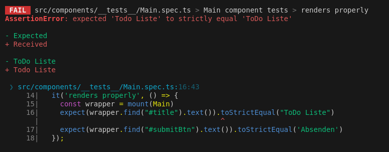
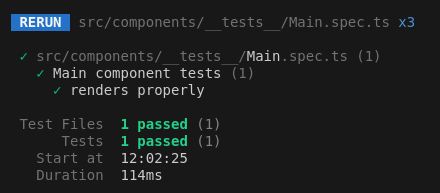
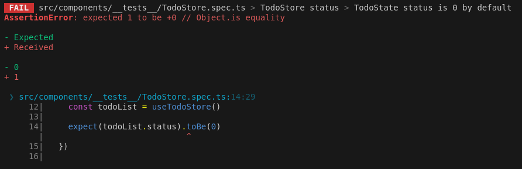
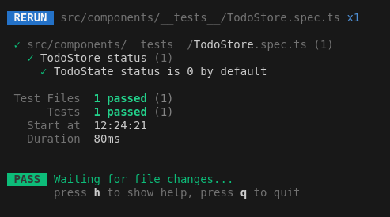

# Unit Testing Documentation

## Inhaltsverzeichnis
1. [Einleitung](#einleitung)
2. [Setup Anweisungen](#setup-anweisungen)
    1. [Node.js und npm installieren](#nodejs-und-npm-installieren)
3. [Verzeichnis Aufbau für Tests](#verzeichnis-aufbau-für-tests)
    1. [Frontend](#frontend)
4. [Tests Schreiben und Ergebnisse](#tests-schreiben-und-ergebnisse)
    1. [Main.spec.ts Test](#mainspects-test)
    2. [TodoStore.spec.ts Test](#todostorespects-test)
5. [Tests Ausführen](#tests-ausführen)
    1. [Ausführen der Frontend Unit Tests](#ausführen-der-frontend-unit-tests)

---

## Einleitung

Diese Dokumentation beschreibt die Einrichtung, Organisation und Ausführung von Unit-Tests für Frontend- und Backend.

## Setup Anweisungen

Um die folgenden Schritte auszuführen, müssen Sie das Projekt von GitHub klonen:
    
```bash
git clone https://github.com/jasontermine/M324_devops.git
```

Anschliessend in das Verzeichnis `M324_devops` wechseln:
    
```bash
cd M324_devops
```

### Node.js und npm installieren

1. **Node.js und npm installieren**

    *Linux*: Terminal öffnen und folgenden Befehl ausführen:
    ```bash
    sudo apt install nodejs npm
    ```

    ```
    # installs nvm (Node Version Manager)
    curl -o- https://raw.githubusercontent.com/nvm-sh/nvm/v0.39.7/install.sh | bash

    # download and install Node.js (you may need to restart the terminal)
    nvm install 20

    # verifies the right Node.js version is in the environment
    node -v # should print `v20.15.0`

    # verifies the right NPM version is in the environment
    npm -v # should print `10.7.0`
    ```
    *Windows* und *macOS*: 
    
    - Node.js von der [offiziellen Website](https://nodejs.org/en) herunterladen und installieren.

2. **Abhängigkeiten für das FE installieren**
    
    In das `frontend` Verzeichnis wechseln und anschliessend die Abhängigkeiten installieren.
    
        ```bash
        npm install
        ```

## Verzeichnis Aufbau für Tests

### Frontend

Die Main.vue Komponente wird getestet, um sicherzustellen, dass sie die richtigen Texte enthält. Der TodoStore wird ebenfalls getestet, um sicherzustellen, dass der Status standardmässig auf 0 gesetzt ist.

- **Verzeichnis Aufbau:**
    ```
    src/
        components/
            __tests__/
                Main.spec.ts (Test für Main.vue)
                TodoStore.spec.ts (Test für TodoStore.ts)
    ```

## Tests Schreiben und Ergebnisse

### Main.spec.ts Test

 Test schlägt fehl, wenn der Test einen Inhalt von "ToDo Liste" und "Absenden" erwartet, jedoch im Code nicht implementiert ist:
 
    
```ts
import { describe, it, expect, beforeEach } from 'vitest'
import { createPinia, setActivePinia } from 'pinia'
import { mount } from '@vue/test-utils'
import Main from '@/components/Main.vue'

describe('Main component tests', () => {
    /**
     * Sets up the Pinia store because the Main component uses the TodoStore
     */
    beforeEach(() => {
        setActivePinia(createPinia())
    })
    
    /**
    * Tests if the Main component contains the correct text 
    */
    it('renders properly', () => {
        const wrapper = mount(Main)
        expect(wrapper.find("#title").text()).toStrictEqual("ToDo Liste")
        expect(wrapper.find("#submitBtn").text()).toStrictEqual('Absenden')
    });

})
```
    


Test erfolgreich, da im Code die richtigen texte implementiert wurden:

```html
<template>
    <div style="margin: auto; width: 50%;">
        <div style="text-align: center;">
        <h1 id="title">ToDo Liste</h1>

        <form @submit.prevent="handleSubmit(todoDescription)">
            <input v-model="todoDescription"/>
            <button id="submitBtn" type="submit">Absenden</button>
        </form>
        </div>
    </div>
</template>

```




### TodoStore.spec.ts Test


Test schlägt fehl, da der Test einen Status Standardwert von 0 erwartet, jedoch im Code '1' implementiert ist:

```ts
import { useTodoStore } from '@/stores/todoStore'
import { createPinia, setActivePinia } from 'pinia'
import { beforeEach, describe, expect, it } from 'vitest'

beforeEach(() => {
    setActivePinia(createPinia());
})

describe('TodoStore status', () => {

  it('TodoState status is 0 by default', () => {
    const todoList = useTodoStore()

    expect(todoList.status).toBe(0)
  })

})
```



Test erfolgreich, da im Code der Status auf 0 gesetzt wurde:

```ts
import { base } from "@/domain/axios";
import { defineStore } from "pinia";
import type { AxiosResponse } from "axios";

export interface ITodo {
  taskdescription: string;
}

interface ITodoResponse {
  status: number;
  data: Array<ITodo>;
}

const todoState: ITodoResponse = {
  // Code wurde angepasst für Unit Test
  status: 0, 
  data: [],
};

type TodoState = typeof todoState;

export const useTodoStore = defineStore("todoStore", {
  state: (): TodoState => ({
    ...todoState,
  }),

  getters: {
    /**
     * Get the list of todos
     * @param {ITodo[]} state - The state of the store
     * @returns - The list of todos
     */
    getTodoList(state): Array<ITodo> {
      return state.data;
    },
  },

  actions: {
    /**
     * Set the todo list
     * @param {ITodoResponse} data - The response data from the API
     */
    setTodo(data: ITodoResponse): void {
      this.status = data.status;
      this.data = data.data;
    },

    /**
     * Fetch the todo list from the API and set the response data (Todos) to the store
     */
    fetchTodoList(): void {
      const response: Promise<AxiosResponse<ITodoResponse, any>> = base.get<ITodoResponse>("/");

      response
        .then((res: AxiosResponse<ITodoResponse, any>) => {
          const data: ITodoResponse = {
            status: res.status,
            // @ts-expect-error
            data: res.data,
          };

          this.setTodo(data);
        })
        .catch((err) => {
          console.error(err);
        });
    },

    /**
     * Post a new todo to the API and fetch the updated todo list
     * @param {string} text - The text of the todo
     */
    async postTodo(text: string): Promise<void> {
      const payload = {
        taskdescription: text.trim(),
      };

      await base
        .post<ITodoResponse>("/tasks", payload)
        .then((res: AxiosResponse<ITodoResponse, any>) => {
          this.fetchTodoList();
        })
        .catch((err) => {
          console.error(err);
        });
    },

    /**
     * Delete a todo from the API and fetch the updated todo list
     * @param {string} taskdescription - The task description of the todo
     */
    async deleteTodo(taskdescription: string): Promise<void> {
      const payload: ITodo = {
        "taskdescription": taskdescription,
      };

      await base
        .post(`/delete`, payload )
        .then((res: AxiosResponse<any, any>) => {
          this.fetchTodoList();
        })
        .catch((err) => {
          console.error(err);
        });
    },
  },
});
```



## Tests Ausführen

### Ausführen der Frontend Unit Tests

1. In das `frontend` Verzeichnis wechseln:
    ```bash
    cd frontend
    ```

2. Frontend Unit Tests ausführen:
    ```bash
    npm run test
    ```

3. (Optional) Einzelnte Tests-Files ausführen:
    ```bash
    npm run test TodoStore.spec.ts
    ```
    oder
    ```bash
    npm run test Main.spec.ts
    ```
    