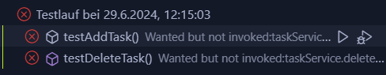
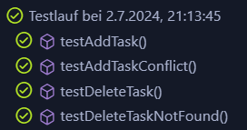

# Unit Testing Documentation

## Inhaltsverzeichnis
1. [Einleitung](#einleitung)
2. [Setup Anweisungen](#setup-anweisungen)
    1. [Node.js und npm installieren](#nodejs-und-npm-installieren)
3. [Verzeichnis Aufbau für Tests](#verzeichnis-aufbau-für-tests)
    1. [Frontend](#frontend)
    2. [Backend](#backend)
4. [Tests Schreiben und Ergebnisse](#tests-schreiben-und-ergebnisse)
    1. [Frontend](#frontend-1)
        1. [Main.spec.ts Test](#mainspects-test)
            1. [Test Fehlgeschlagen](#test-fehlgeschlagen)
            2. [Angepasster Main.vue Code](#angepasster-mainvue-code)
        2. [TodoStore.spec.ts Test](#todostorespects-test)
            1. [Test Fehlgeschlagen](#test-fehlgeschlagen-1)
            2. [Angepasster TodoStore.ts Code](#angepasster-todostorets-code)
    2. [Backend](#backend-1)
        1. [DemoApplicationTests](#demoapplicationtests)
        2. [Erklärung der Tests](#erklärung-der-tests)
        3. [Fehlgeschlagene und erfolgreiche Tests](#fehlgeschlagene-und-erfolgreiche-tests)
        4. [Angepasste DemoApplication Klasse](#angepasste-demoapplication-klasse)
5. [Tests Ausführen](#tests-ausführen)
    1. [Frontend](#frontend-2)
    2. [Backend](#backend-2)
---

## Einleitung

Diese Dokumentation beschreibt die Einrichtung, Organisation und Ausführung von Unit-Tests für Frontend- und Backend.

## Setup Anweisungen

Um die folgenden Schritte auszuführen, müssen Sie das Projekt von GitHub klonen:
    
```bash
git clone https://github.com/jasontermine/M324_devops.git
```

Anschliessend in das Verzeichnis `M324_devops` wechseln:
    
```bash
cd M324_devops
```

### Node.js und npm installieren

1. **Node.js und npm installieren**

    *Linux*: Terminal öffnen und folgenden Befehl ausführen:
    ```bash
    sudo apt install nodejs npm
    ```

    ```
    # installs nvm (Node Version Manager)
    curl -o- https://raw.githubusercontent.com/nvm-sh/nvm/v0.39.7/install.sh | bash

    # download and install Node.js (you may need to restart the terminal)
    nvm install 20

    # verifies the right Node.js version is in the environment
    node -v # should print `v20.15.0`

    # verifies the right NPM version is in the environment
    npm -v # should print `10.7.0`
    ```
    *Windows* und *macOS*: 
    
    - Node.js von der [offiziellen Website](https://nodejs.org/en) herunterladen und installieren.

2. **Abhängigkeiten für das FE installieren**
    
    In das `frontend` Verzeichnis wechseln und anschliessend die Abhängigkeiten installieren.
    
    ```bash
    npm install
    ```

## Verzeichnis Aufbau für Tests

### Frontend

Die Main.vue Komponente wird getestet, um sicherzustellen, dass sie die richtigen Texte enthält. Der TodoStore wird ebenfalls getestet, um sicherzustellen, dass der Status standardmässig auf 0 gesetzt ist.

- **Verzeichnis Aufbau:**
    ```
    src/
        components/
            __tests__/
                Main.spec.ts (Test für Main.vue)
                TodoStore.spec.ts (Test für TodoStore.ts)
    ```

### Backend

Im Backend-Verzeichnis `src/test/java/com/example/demo` finden Sie die Testklassen, die für die Unit-Tests verwendet werden.

## Tests Schreiben und Ergebnisse

### Frontend

### Main.spec.ts Test

 Test schlägt fehl, wenn der Test einen Text-Inhalt von "ToDo Liste" und "Absenden" erwartet, jedoch im Code nicht implementiert ist:
 
    
```ts
import { describe, it, expect, beforeEach } from 'vitest'
import { createPinia, setActivePinia } from 'pinia'
import { mount } from '@vue/test-utils'
import Main from '@/components/Main.vue'

describe('Main component tests', () => {
    /**
     * Sets up the Pinia store because the Main component uses the TodoStore
     */
    beforeEach(() => {
        setActivePinia(createPinia())
    })
    
    /**
    * Tests if the Main component contains the correct text 
    */
    it('renders properly', () => {
        const wrapper = mount(Main)
        expect(wrapper.find("#title").text()).toStrictEqual("ToDo Liste")
        expect(wrapper.find("#submitBtn").text()).toStrictEqual('Absenden')
    });

})
```
    
### Test Fehlgeschlagen


### Angepasster Main.vue Code

Test erfolgreich, da im Code die richtigen texte implementiert wurden:

```html
<template>
    <div style="margin: auto; width: 50%;">
        <div style="text-align: center;">
        <!-- Angepasst -->
        <h1 id="title">ToDo Liste</h1>

        <form @submit.prevent="handleSubmit(todoDescription)">
            <input v-model="todoDescription"/>
            <!-- Angepasst -->
            <button id="submitBtn" type="submit">Absenden</button>
        </form>
        </div>
    </div>
</template>

```


### TodoStore.spec.ts Test


Test schlägt fehl, da der Test einen Status Standardwert von 0 erwartet, jedoch im Code '1' implementiert ist:

```ts
import { useTodoStore } from '@/stores/todoStore'
import { createPinia, setActivePinia } from 'pinia'
import { beforeEach, describe, expect, it } from 'vitest'

beforeEach(() => {
    setActivePinia(createPinia());
})

describe('TodoStore status', () => {

  it('TodoState status is 0 by default', () => {
    const todoList = useTodoStore()

    expect(todoList.status).toBe(0)
  })

})
```

### Test Fehlgeschlagen


### Angepasster TodoStore.ts Code

Test erfolgreich, da im Code der Status auf 0 gesetzt wurde:

```ts
import { base } from "@/domain/axios";
import { defineStore } from "pinia";
import type { AxiosResponse } from "axios";

export interface ITodo {
  taskdescription: string;
}

interface ITodoResponse {
  status: number;
  data: Array<ITodo>;
}

const todoState: ITodoResponse = {
  status: 0, // Wert / Code wurde angepasst für Unit Test
  data: [],
};

type TodoState = typeof todoState;

export const useTodoStore = defineStore("todoStore", {
  state: (): TodoState => ({
    ...todoState,
  }),

  getters: {
    /**
     * Get the list of todos
     * @param {ITodo[]} state - The state of the store
     * @returns - The list of todos
     */
    getTodoList(state): Array<ITodo> {
      return state.data;
    },
  },

  actions: {
    /**
     * Set the todo list
     * @param {ITodoResponse} data - The response data from the API
     */
    setTodo(data: ITodoResponse): void {
      this.status = data.status;
      this.data = data.data;
    },

    /**
     * Fetch the todo list from the API and set the response data (Todos) to the store
     */
    fetchTodoList(): void {
      const response: Promise<AxiosResponse<ITodoResponse, any>> = base.get<ITodoResponse>("/");

      response
        .then((res: AxiosResponse<ITodoResponse, any>) => {
          const data: ITodoResponse = {
            status: res.status,
            // @ts-expect-error
            data: res.data,
          };

          this.setTodo(data);
        })
        .catch((err) => {
          console.error(err);
        });
    },

    /**
     * Post a new todo to the API and fetch the updated todo list
     * @param {string} text - The text of the todo
     */
    async postTodo(text: string): Promise<void> {
      const payload = {
        taskdescription: text.trim(),
      };

      await base
        .post<ITodoResponse>("/tasks", payload)
        .then((res: AxiosResponse<ITodoResponse, any>) => {
          this.fetchTodoList();
        })
        .catch((err) => {
          console.error(err);
        });
    },

    /**
     * Delete a todo from the API and fetch the updated todo list
     * @param {string} taskdescription - The task description of the todo
     */
    async deleteTodo(taskdescription: string): Promise<void> {
      const payload: ITodo = {
        "taskdescription": taskdescription,
      };

      await base
        .post(`/delete`, payload )
        .then((res: AxiosResponse<any, any>) => {
          this.fetchTodoList();
        })
        .catch((err) => {
          console.error(err);
        });
    },
  },
});
```


### Backend

### DemoApplicationTests

Diese Testklasse überprüft die Funktionalität der Methoden `addTask` und `deleteTask` in der `DemoApplication`-Klasse.

```java
package com.example.demo;

import static org.junit.jupiter.api.Assertions.assertEquals;
import static org.junit.jupiter.api.Assertions.assertTrue;
import static org.mockito.ArgumentMatchers.any;
import static org.mockito.Mockito.verify;
import static org.mockito.Mockito.when;

import java.util.List;

import org.junit.jupiter.api.BeforeEach;
import org.junit.jupiter.api.Test;
import org.mockito.InjectMocks;
import org.mockito.Mock;
import org.mockito.MockitoAnnotations;
import org.springframework.boot.test.context.SpringBootTest;
import org.springframework.boot.test.mock.mockito.MockBean;

@SpringBootTest
class DemoApplicationTests {

    @MockBean
    private TaskRepository taskRepository;

    @Mock
    private TaskService taskService;

    @InjectMocks
    private DemoApplication demoApplication;

    @BeforeEach
    void setUp() {
        MockitoAnnotations.openMocks(this);
        // Fügen Sie einen Task zur lokalen Liste hinzu, um die Bedingung zu erfüllen
        Task task = new Task();
        task.setTaskdescription("Test Task");
        List<Task> tasks = demoApplication.getTasks();
        tasks.add(task);
    }

    @Test
    void testAddTask() {
        // Arrange
        String taskDescription = "{\"taskdescription\":\"Test Task\"}";

        Task savedTask = new Task();
        savedTask.setTaskdescription("Test Task");

        when(taskService.saveTask(any(Task.class))).thenReturn(savedTask);

        // Act
        String result = demoApplication.addTask(taskDescription);

        // Assert
        assertEquals("redirect:/", result);
        verify(taskService).saveTask(any(Task.class));
    }

    @Test
    void testDeleteTask() {
        // Arrange
        String taskDescription = "{\"taskdescription\":\"Test Task\"}";
        Task task = new Task();
        task.setTaskdescription("Test Task");

        when(taskService.findByDescription("Test Task")).thenReturn(task);

        // Act
        String result = demoApplication.delTask(taskDescription);

        // Assert
        assertEquals("redirect:/", result);
        verify(taskService).findByDescription("Test Task");
        verify(taskService).deleteTaskByDescription("Test Task");
    }

    @Test
    void contextLoads() {
        assertTrue(true, "alles gut");
    }
}
```

### Erklärung der Tests

1. **Setup-Methode**:
   - Vor jedem Test wird ein neuer Task zur lokalen Liste `tasks` in der `DemoApplication`-Klasse hinzugefügt, um die Bedingung für die Tests zu erfüllen.

2. **Test für `addTask`**:
   - Überprüft, ob die Methode `addTask` den Task korrekt hinzufügt und `taskService.saveTask` aufgerufen wird.

3. **Test für `deleteTask`**:
   - Überprüft, ob die Methode `delTask` den Task korrekt löscht und `taskService.deleteTaskByDescription` aufgerufen wird.

4. **contextLoads**:
   - Ein einfacher Test, um sicherzustellen, dass der Anwendungskontext korrekt geladen wird.

## Fehlgeschlagene und erfolgreiche Tests

### Fehlgeschlagene Tests

Zu Beginn schlugen die Tests fehl, da die Methode `deleteTaskByDescription` nicht korrekt aufgerufen wurde. Hier ist ein Screenshot der fehlgeschlagenen Tests:



### Erfolgreiche Tests

Nachdem die Implementierung angepasst wurde, um sicherzustellen, dass die Methode korrekt aufgerufen wird, liefen die Tests erfolgreich. Hier ist ein Screenshot der erfolgreichen Tests:



## Angepasste DemoApplication Klasse

Die `DemoApplication` Klasse wurde angepasst, um die Tests erfolgreich zu bestehen:

```java
package com.example.demo;

import java.util.ArrayList;
import java.util.Iterator;
import java.util.List;

import org.springframework.beans.factory.annotation.Autowired;
import org.springframework.boot.SpringApplication;
import org.springframework.boot.autoconfigure.SpringBootApplication;
import org.springframework.web.bind.annotation.CrossOrigin;
import org.springframework.web.bind.annotation.GetMapping;
import org.springframework.web.bind.annotation.PostMapping;
import org.springframework.web.bind.annotation.RequestBody;
import org.springframework.web.bind.annotation.RestController;

import com.fasterxml.jackson.core.JsonProcessingException;
import com.fasterxml.jackson.databind.ObjectMapper;

@RestController
@SpringBootApplication
public class DemoApplication {

    public static void main(String[] args) {
        SpringApplication.run(DemoApplication.class, args);
    }

    @Autowired
    private TaskService taskService;

    private List<Task> tasks = new ArrayList<>();
    private ObjectMapper mapper = new ObjectMapper();

    @CrossOrigin
    @GetMapping("/")
    public List<Task> getTasks() {
        System.out.println("API EP '/' returns task-list.");
        List<Task> allTasks = new ArrayList<>(tasks);
        allTasks.addAll(taskService.getAllTasks()); // Add all tasks from the database
        if (!allTasks.isEmpty()) {
            int i = 1;
            for (Task task : allTasks) {
                System.out.println("-task " + (i++) + ":" + task.getTaskdescription());
            }
        }
        return allTasks; // actual task list (internally converted to a JSON stream)
    }

    @CrossOrigin
    @PostMapping("/tasks")
    public String addTask(@RequestBody String taskDescriptionJson) {
        System.out.println("API EP '/tasks': '" + taskDescriptionJson + "'");
        try {
            Task task = mapper.readValue(taskDescriptionJson, Task.class);
            for (Task t : tasks) {
                if (t.getTaskdescription().equals(task.getTaskdescription())) {
                    System.out.println(">>>task: '" + task.getTaskdescription() + "' already exists!");
                    return "redirect:/"; // duplicates will be ignored
                }
            }
            System.out.println("...adding task: '" + task.getTaskdescription() + "'");
            tasks.add(task);
            taskService.saveTask(task); // Persist the task
        } catch (JsonProcessingException e) {
            e.printStackTrace();
        }
        return "redirect:/";
    }

    @CrossOrigin
    @PostMapping("/delete")
    public String delTask(@RequestBody String taskDescriptionJson) {
        System.out.println("API EP '/delete': '" + taskDescriptionJson + "'");
        try {
            Task task = mapper.readValue(taskDescriptionJson, Task.class);
            Task existingTask = taskService.findByDescription(task.getTaskdescription());
            System.out.println("existingTask: " + (existingTask != null ? existingTask.getTaskdescription() : "null"));
            if (existingTask != null) {
                taskService.deleteTaskByDescription(task.getTaskdescription());
                Iterator<Task> it = tasks.iterator();
                while (it.hasNext()) {
                    Task t = it.next();
                    if (t.getTaskdescription().equals(task.getTaskdescription())) {
                        System.out.println("...deleting task: '" + task.getTaskdescription() + "'");
                        it.remove();
                        return "redirect:/";
                    }
                }
                System.out.println("taskService.deleteTaskByDescription called"); // Logging for verification
            }
            System.out.println(">>>task: '" + task.getTaskdescription() + "' not found!");
        } catch (JsonProcessingException e) {
            e.printStackTrace();
        }
        return "redirect:/";
    }
}
```

## Tests Ausführen

### Frontend

Um die Frontend-Tests auszuführen, verwenden Sie npm (mit der Vitest-Library). Gehen Sie ins Frontend-Verzeichnis und führen Sie die folgenden Befehle aus:

1. In das `frontend` Verzeichnis wechseln:
    ```bash
    cd frontend
    ```

2. Frontend Unit Tests ausführen:
    ```bash
    npm run test
    ```

3. (Optional) Einzelne Test-Files ausführen:
    ```bash
    npm run test TodoStore.spec.ts
    ```
    oder
    ```bash
    npm run test Main.spec.ts
    ```
    
### Backend

Um die Backend-Tests auszuführen, verwenden Sie Maven. Gehen Sie ins Backend-Verzeichnis und führen Sie die folgenden Befehle aus:

1. Wechseln Sie in das Backend-Verzeichnis:
    ```bash
    cd backend
    ```

2. Führen Sie die Tests aus:
    ```bash
    mvn test
    ```
