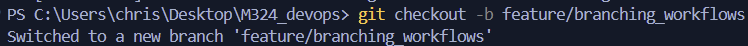
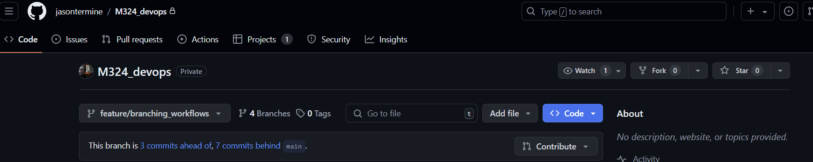
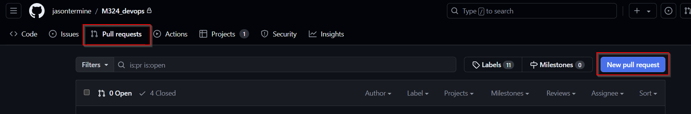
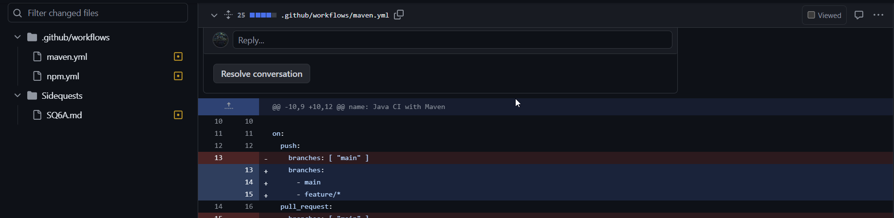
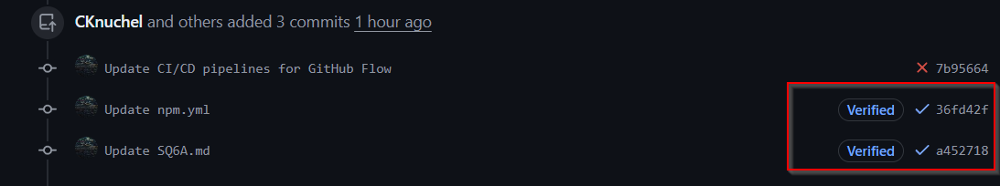
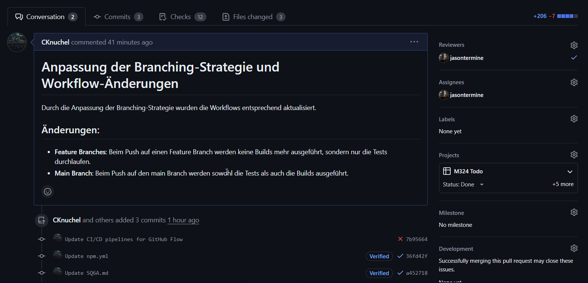
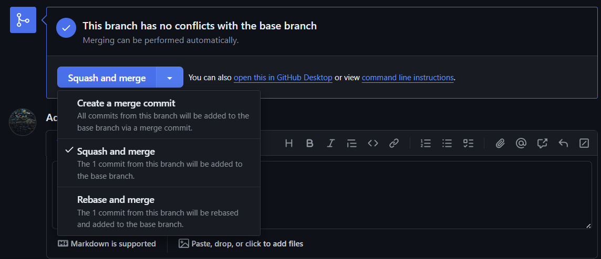
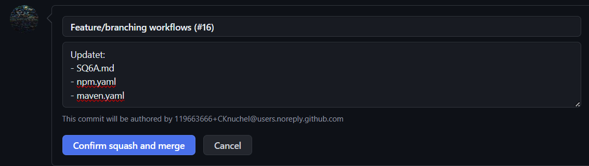
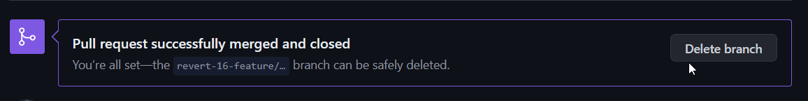

# Branching-Strategien für ein Software-Projekt

## Inhaltsverzeichnis
- [Recherchierte Branching-Strategien](#recherchierte-branching-strategien)
- [Vergleich der Branching-Strategien](#vergleich-der-branching-strategien)
- [Auswahl einer Branching-Strategie](#auswahl-einer-branching-strategie)
- [Analyse des bestehenden Projekts](#analyse-des-bestehenden-projekts)
- [Umsetzung der GitHub Flow Strategie im bestehenden Projekt](#umsetzung-der-github-flow-strategie-im-bestehenden-projekt)
- [Dokumentation der durchgeführten Arbeiten](#dokumentation-der-durchgeführten-arbeiten)
  - [Initialisieren eines Feature Branches](#initialisieren-eines-feature-branches)
  - [Anpassen der Worklfow-Regeln](#anpassen-der-worklfow-regeln)
  - [Anpassen der CI/CD-Pipelines](#anpassen-der-cicd-pipelines)
  - [Hinzufügen der Änderungen zum Staging](#hinzufügen-der-änderungen-zum-staging)
  - [Erstellen eines Pull Requests](#erstellen-eines-pull-requests)
- [Literatur](#literatur)

## Recherchierte Branching-Strategien
- **Git Flow**
- **GitHub Flow**
- **Feature Branching**
- **Trunk-based Development**

## Vergleich der Branching-Strategien

| Strategie               | Beschreibung                                                                 | Vorteile                                                                                             | Nachteile                                                                                          | Anwendungsbeispiele                       |
|-------------------------|-----------------------------------------------------------------------------|------------------------------------------------------------------------------------------------------|---------------------------------------------------------------------------------------------------|------------------------------------------|
| Git Flow                | Detaillierte Strategie mit mehreren Branches (main, develop, feature, release, hotfix).  | Klare Trennung von Entwicklungs- und Produktivzweigen, gut für größere Projekte.                     | Komplexität, Overhead durch viele Branches.                                                       | Große, komplexe Projekte mit festen Release-Zyklen. |
| GitHub Flow             | Einfache Strategie mit einem main Branch und feature Branches.               | Einfachheit, schnelleres Deployment, gut für Continuous Deployment.                                 | Nicht geeignet für Projekte mit langen Entwicklungszyklen.                                         | Projekte, die kontinuierlich ausgeliefert werden.  |
| Feature Branching       | Jeder neue Feature wird in einem separaten Branch entwickelt.                | Isolierung von Features, einfache Code-Reviews.                                                      | Kann zu vielen langen lebenden Branches führen, Merge-Konflikte.                                  | Projekte mit klar definierten, voneinander getrennten Features. |
| Trunk-based Development | Entwickler integrieren kleine Änderungen häufig direkt in den main Branch.   | Weniger Merge-Konflikte, kontinuierliche Integration, schnelleres Feedback.                          | Erfordert strenge CI/CD-Pipelines, höhere Anforderungen an Tests und Code-Qualität.               | Projekte mit hoher Änderungsgeschwindigkeit, wo kontinuierliche Integration notwendig ist. |

## Auswahl einer Branching-Strategie
**Ausgewählte Strategie: GitHub Flow**

**Begründung:**
- **Einfachheit:** Die einfache Struktur erleichtert es, den Überblick zu behalten und vermeidet unnötigen Overhead.
- **Continuous Deployment:** Die Strategie ermöglicht häufige Releases und ist ideal für Projekte, die kontinuierlich ausgeliefert werden.

## Analyse des bestehenden Projekts

**Anforderungen für die Anwendung der GitHub Flow Strategie:**
- **Häufige kleine Releases:** Unser Projekt hat eine hohe Änderungsfrequenz, was gut zu GitHub Flow passt.
- **Code-Review-Prozess:** Wir benötigen ein effizientes System für Code-Reviews und das Zusammenführen von Branches.

## Umsetzung der GitHub Flow Strategie im bestehenden Projekt

1. **Branch-Erstellung:**
   - **main:** Der stabile Produktions-Branch.
   - **feature branches:** Für jedes neue Feature oder jede Änderung wird ein separater Branch erstellt, z.B. `feature/feature-name`.

2. **Workflow-Regeln:**
   - **Branch-Namen:** Einheitliche Namenskonventionen für feature branches.
   - **Pull Requests (PRs):** Jede Änderung wird über PRs in den main Branch gemerged.
   - **Code-Reviews:** Mindestens ein Kollege muss den Code prüfen und freigeben, bevor ein PR gemerged wird.
   - **Automatisierte Tests:** Jeder PR löst automatisierte Tests aus, die bestanden werden müssen, bevor der Merge erfolgt.

3. **Praktische Durchführung:**
   - Branches werden gemäß den festgelegten Regeln erstellt und bearbeitet.
   - Code-Reviews und Tests werden konsequent durchgeführt.
   - Erfolgreiche PRs werden in den main Branch gemerged und sofort deployed.

## Dokumentation der durchgeführten Arbeiten
### Initialisieren eines Feature Branches
```bash
# Erstellen eines neuen Branches
git checkout -b feature/toast-messages
```


### Anpassen der Worklfow-Regeln
Um die Github Flow-Straegie umzusetzen, müssen wir die Workflow-Regeln anpassen.

Durch das einhalten der Namenskonventionen für Branches, können wir sicherstellen, dass die Branches eindeutig und leicht identifizierbar sind. 

Da für Features keine Builds erstellt werden müssen, können wir die CI/CD-Pipelines so konfigurieren, dass Tests für alle Branches ausgeführt werden, um sicherzustellen das keine Fehler in den Code gelangen. Falls eine Änderung in den main Branch gemerged wird, wird zusätzlich ein Build ausgelöst, um sicherzustellen, dass die Änderungen den Anforderungen entsprechen.

### Anpassen der CI/CD-Pipelines
#### maven.yml
```yaml
# This workflow will build a Java project with Maven, and cache/restore any dependencies to improve the workflow execution time
# For more information see: https://docs.github.com/en/actions/automating-builds-and-tests/building-and-testing-java-with-maven

# This workflow uses actions that are not certified by GitHub.
# They are provided by a third-party and are governed by
# separate terms of service, privacy policy, and support
# documentation.

name: Java CI with Maven

on:
  push:
    branches: 
      - main
      - feature/*
  pull_request:
    branches: 
      - main

jobs:
  build:

    runs-on: ubuntu-latest

    steps:
    - uses: actions/checkout@v3
    - name: Set up JDK 17
      uses: actions/setup-java@v3
      with:
        java-version: '17'
        distribution: 'temurin'
        cache: maven

    - name: Test
      run: mvn -f Sidequests/SQ2A/M324_PROJEKT_TODOLIST/backend --batch-mode -Dmaven.test.failure.ignore=true test

  build_main:
    if: github.ref == 'refs/heads/main'
    runs-on: ubuntu-latest

    steps:
    - uses: actions/checkout@v3
    - name: Set up JDK 17
      uses: actions/setup-java@v3
      with:
        java-version: '17'
        distribution: 'temurin'
        cache: maven

    - name: Test
      run: mvn -f Sidequests/SQ2A/M324_PROJEKT_TODOLIST/backend --batch-mode -Dmaven.test.failure.ignore=true test

    - name: Build with Maven
      run: mvn -B package --file Sidequests/SQ2A/M324_PROJEKT_TODOLIST/backend/pom.xml
```

Hier haben wir die CI/CD-Pipeline so angepasst, dass sie für alle Branches ausgeführt wird. Wenn ein Feature-Branch gemerged wird, wird ein Build ausgelöst, um sicherzustellen, dass die Änderungen den Anforderungen entsprechen. Durch das if-Statement wird sichergestellt, dass der Build nur für den main Branch ausgeführt wird.

#### npm.yml
```yaml
name: Run Vite Tests

on:
  push:
    branches: 
      - main
      - feature/*
  pull_request:
    branches: 
      - main

jobs:
  test:
    runs-on: ubuntu-latest

    steps:
      - name: Checkout repository
        uses: actions/checkout@v2

      - name: Set up Node.js
        uses: actions/setup-node@v2
        with:
          node-version: '20'

      - name: Install dependencies
        run: |
          cd Sidequests/SQ2A/M324_PROJEKT_TODOLIST/frontend
          npm install

      - name: Run tests
        run: |
          cd Sidequests/SQ2A/M324_PROJEKT_TODOLIST/frontend
          npm run test

  build_main:
    if: github.ref == 'refs/heads/main'
    runs-on: ubuntu-latest

    steps:
      - name: Checkout repository
        uses: actions/checkout@v2

      - name: Set up Node.js
        uses: actions/setup-node@v2
        with:
          node-version: '20'

      - name: Install dependencies
        run: |
          cd Sidequests/SQ2A/M324_PROJEKT_TODOLIST/frontend
          npm install

      - name: Run tests
        run: |
          cd Sidequests/SQ2A/M324_PROJEKT_TODOLIST/frontend
          npm run test

      - name: Build
        run: |
          cd Sidequests/SQ2A/M324_PROJEKT_TODOLIST/frontend
          npm run build

```

### Hinzufügen der Änderungen zum Staging
```bash
# Hinzufügen der Änderungen zum Staging
git add .

# Commiten der Änderungen
git commit -m "Update CI/CD pipelines for GitHub Flow"

# Pushen der Änderungen zum Remote-Repository
git push origin feature/branching_workflows
```


### Erstellen eines Pull Requests
Die Pull Request erstellen wir über die GitHub-Oberfläche. Hier können wir die Änderungen noch einmal überprüfen und sicherstellen, dass die CI/CD-Pipelines erfolgreich durchlaufen wurden.

Hier sind wir mit folgenden Schritten vorgegangen:
1. **Branch auswählen:** Wir wählen den Branch aus, in den die Änderungen gemerged werden sollen.


2. **Pull Request erstellen:** Hierzu klicken wir auf den Button "New pull request".


3. **Überprüfung der Änderungen:** Wir überprüfen die Änderungen und stellen sicher, dass die CI/CD-Pipelines erfolgreich durchlaufen wurden.



4. **Pull Request erstellen:** Wir erstellen den Pull Request und fügen eine Beschreibung hinzu, um die Änderungen zu erläutern.


6. **Warten auf Review:** Ein Kollege überprüft die Änderungen und gibt das OK, um den Pull Request zu mergen.

7. **Pull Request mergen:** Nachdem der Pull Request freigegeben wurde, können wir ihn in den main Branch mergen. Hierzu verwenden wir den Button "Merge pull request". Wir wählen die Option "Squash and merge", um die Änderungen in einem Commit zusammenzufassen.


8. **Zusammenfassung:** Nach dem Mergen des Pull Requests erhalten wir eine Zusammenfassung der Änderungen und können den Erfolg des Merges überprüfen.


9. **Löschen des Branches:** Nachdem der Pull Request gemerged wurde, können wir den Branch löschen, um die Übersichtlichkeit zu wahren.


## Literatur
- [Git Branching Strategies](https://www.atlassian.com/git/tutorials/comparing-workflows)
- [GitHub Flow](https://guides.github.com/introduction/flow/)
- [GitLab Flow](https://docs.gitlab.com/ee/topics/gitlab_flow.html)
