_Christoph Knuchel, Jason Termine_
# Dokumentation zur Erstellung und Durchführung von Pull-Requests in GitHub

### Inhaltsverzeichnis

1. [Funktionsweise von Pull-Requests](#funktionsweise-von-pull-requests)
2. [Schritte zur Durchführung eines Pull-Requests in GitHub](#schritte-zur-durchführung-eines-pull-requests-in-github)
3. [Änderungen am Projekt durchführen und via Pull-Request in den Main-Branch zurückführen](#änderungen-am-projekt-durchführen-und-via-pull-request-in-den-main-branch-zurückführen)
4. [Merge-Strategien ausprobieren und analysieren](#merge-strategien-ausprobieren-und-analysieren)
5. [Nutzen von Pull-Requests](#nutzen-von-pull-requests)
6. [Fazit](#fazit)
7. [Beispiel-Screenshots und kurze Zusammenfassung](#beispiel-screenshots-und-kurze-zusammenfassung)
    6. [Merge Commit](#merge-commit)
    7. [Squash and Merge](#squash-and-merge)
    8. [Rebase and Merge](#rebase-and-merge)

## Funktionsweise von Pull-Requests

Ein Pull-Request ist ein Verfahren, das es Entwicklern ermöglicht, Änderungen an einem Projekt vorzuschlagen und zur Überprüfung einzureichen. Pull-Requests sind ein wichtiger Bestandteil des kollaborativen Entwicklungsprozesses, vorallem in Open-Source Projekten. Code Änderungen können besprochen und überprüft werden bevor man sie in die Produktionsumgebung übernimmt.

## Schritte zur Durchführung eines Pull-Requests in GitHub

1. **Fork das Repository (falls notwendig)**
    - Forken Sie das Repository, in dem Sie Änderungen vornehmen möchten. Dies erstellt eine Kopie des Repositorys in Ihrem GitHub-Account.

2. **Clone das Repository**
    - Klonen Sie das Repository auf Ihren lokalen Rechner:
      ```bash
      git clone https://github.com/jasontermine/M324_Devops
      ```

3. **Erstellen eines neuen Branches**
    - Erstellen Sie einen neuen Branch für Ihre Änderungen:
      ```bash
      git checkout -b feature/branch-name
      ```

4. **Vornehmen von Änderungen**
    - Implementieren Sie die gewünschten Änderungen im Code. Wenn Sie mit der implementierung fertig sind, können sie mit `git status` überprüfen, welche Dateien geändert wurden. Mit `git diff` können sie die genauen Änderungen in den Dateien sehen.

5. **Commit der Änderungen**
    - Fügen Sie die Änderungen zum 'Staging' Bereich hinzu und committen Sie diese:
      ```bash
      git add .
      git commit -m "Kurze aber aussagekräftige Beschreibung der Änderungen"
      ```
      oder sie können einzelne Dateien hinzufügen und committen:
      ```bash
        git add FILE_NAME
        git commit -m "Kurze aber aussagekräftige Beschreibung der Änderungen"
      ```

6. **Push des Branches zu GitHub**
    - Anschliessend können Sie den Branch auf GitHub pushen:
      ```bash
      git push origin feature/branch-name
      ```

7. **Erstellen eines Pull-Requests**
    - Gehen Sie zu Ihrem Repository auf GitHub.
    - Navigieren Sie zur Seite "Pull requests".
    - Klicken Sie auf "New pull request".
    - Wählen Sie den Vergleichsbranch (feature/branch-name) und den Basisbranch (main).
    - Geben Sie eine aussagekräftige Beschreibung Ihrer Änderungen ein und klicken Sie auf "Create pull request".

## Änderungen am Projekt durchführen und via Pull-Request in den Main-Branch zurückführen

1. **Änderungen von Kollegen überprüfen**
    - Öffnen Sie den erstellten Pull-Request.
    - Überprüfen Sie die vorgeschlagenen Änderungen.
    - Diskutieren Sie eventuelle Änderungen oder Anmerkungen im PR-Kommentarbereich.

2. **Merge des Pull-Requests**
    - Nach Abschluss der Überprüfung können Sie den Pull-Request mergen. GitHub bietet verschiedene Merge-Strategien:
      - **Merge Commit**: Erstellt einen neuen Merge-Commit in der Geschichte.
      - **Squash and Merge**: Kombiniert alle Commits des PR in einen einzigen Commit.
      - **Rebase and Merge**: Rebaset die Commits des PR auf den Basisbranch.
    - Klicken Sie auf "Merge pull request" und wählen Sie die gewünschte Merge-Strategie.

## Merge-Strategien ausprobieren und analysieren

- **Merge Commit**: Behält die gesamte Commit-Historie bei, was nützlich für detaillierte Historien ist, aber die Git-Historie aufblähen kann.
- **Squash and Merge**: Sauberer Verlauf mit einem einzigen Commit, aber individuelle Commits gehen verloren.
- **Rebase and Merge**: Saubere Historie ohne Merge-Commits, kann jedoch komplex sein bei Konflikten.

## Nutzen von Pull-Requests

**Vorteile:**
- **Code-Überprüfung**: PRs fördern die Code-Überprüfung / Code-Reviews, was zur Verbesserung der Code-Qualität beiträgt.
- **Diskussion und Feedback**: Ermöglichen Diskussionen über den Code und Vorschläge für Verbesserungen. Zudem beugt es Fehler vor, bevor sie in die Produktion gelangen.
- **Nachverfolgbarkeit**: Änderungen sind dokumentiert und nachvollziehbar.
- **Kollaboration**: Fördert die Zusammenarbeit im Team.

**Nachteile:**
- **Zeitaufwand**: Code-Überprüfungen / Code-Reviews und Diskussionen können zeitaufwendig sein.
- **Komplexität**: Bei vielen PRs können Konflikte und eine komplexe Git-Historie entstehen.

## Fazit

Pull-Requests sind ein mächtiges Werkzeug zur Verbesserung der Code-Qualität und fördern die Zusammenarbeit im Team. Sie erfordern jedoch einen gewissen organisatorischen und zeitlichen Aufwand. Die Wahl der Merge-Strategie sollte je nach Projektanforderungen und Teampräferenzen erfolgen.

---

## Beispiel-Screenshots und kurze Zusammenfassung

1. **Repository forken**
- Klicken Sie in Ihrem gewünschten Repository auf `"Fork"` um das Repository zu forken.
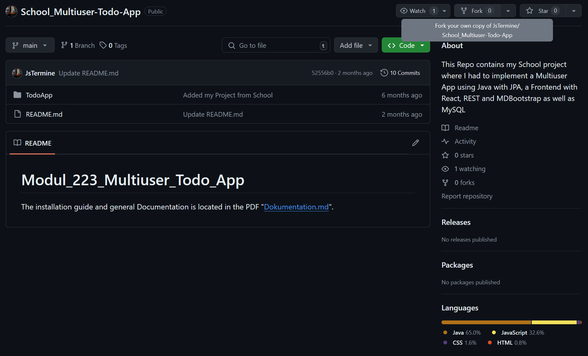
- Das Repository wird nun in Ihrem GitHub-Account geforkt.
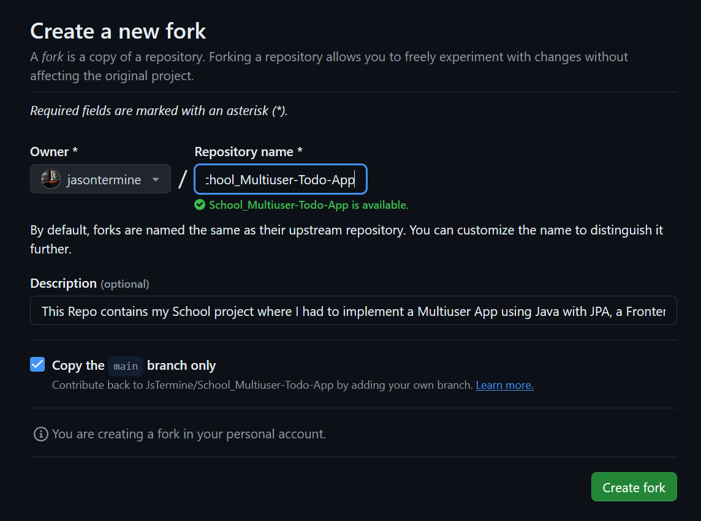
- Der Forked Repository ist nun in ihrem aktuellen GitHub-Account:
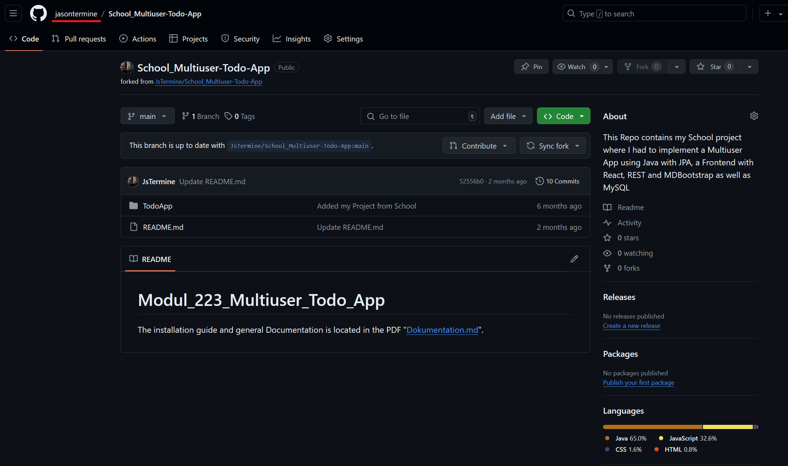
2. **Neuen Branch erstellen**
- Erstellen Sie einen neuen Branch für Ihre Änderungen:
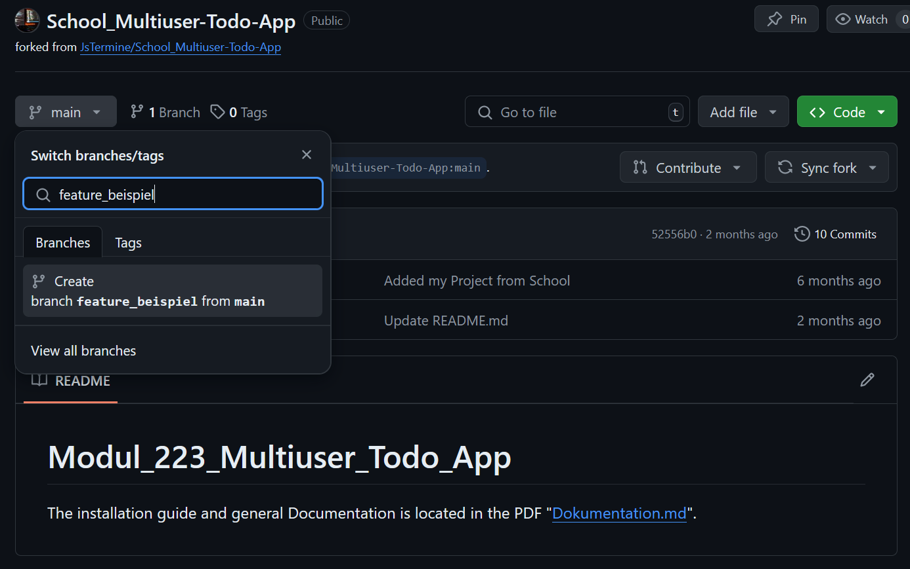
- Der neue Branch wurde erfolgreich erstellt:
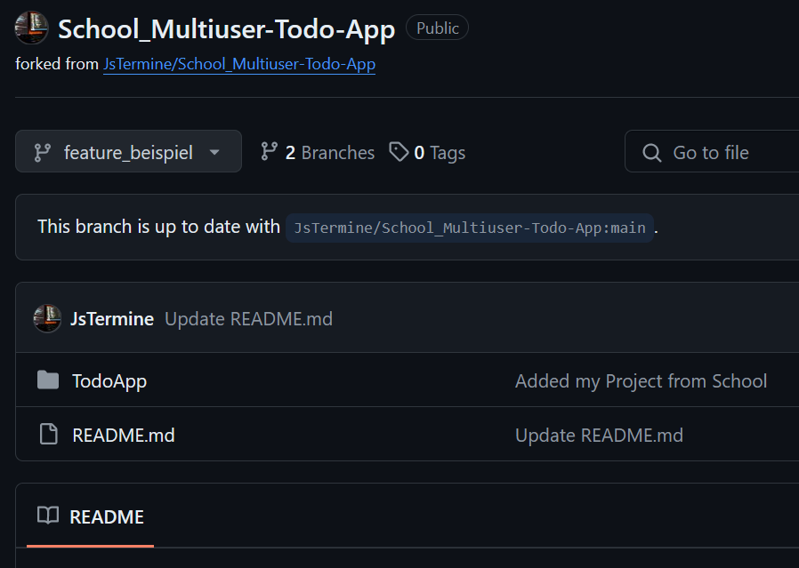
3. **Änderungen vornehmen**
- Implementieren Sie die gewünschten Änderungen im Code.
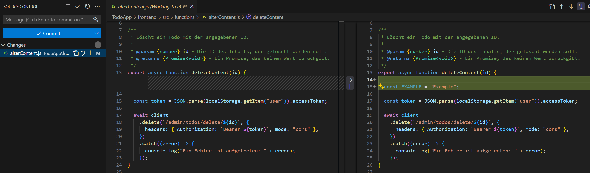
- Fügen Sie die Änderungen zum 'Staging' Bereich hinzu und committen Sie diese:
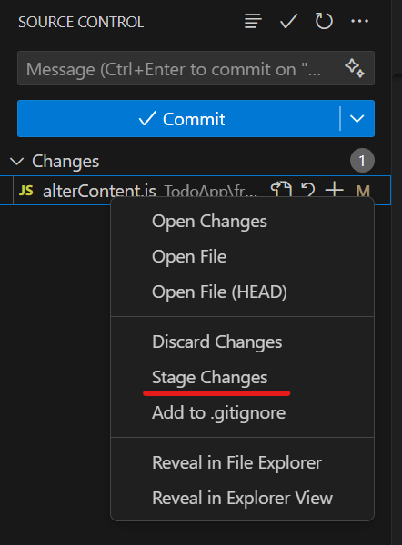
- Pushen des Commit in den feature-Branch (Im IDE den Branch auswählen oder in der Konsole mit `git switch feature_beispiel` oder `git checkout feature_beispiel`):
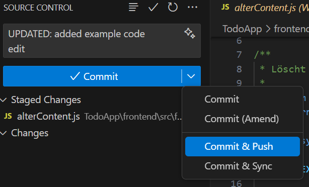
4. **Pull-Request erstellen**
- Gehen Sie zu Ihrem Repository auf GitHub.
- Nachdem sie in Ihrem feature-Branch die Änderungen committet und gepusht haben, können Sie auf `"Compare & pull request"` klicken.
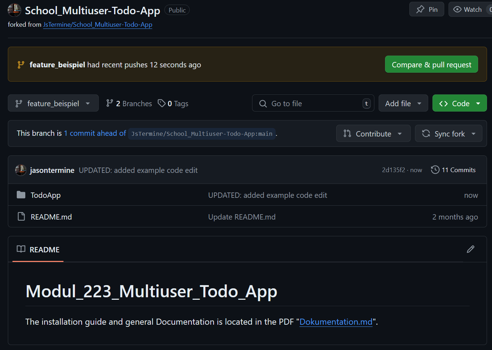
- Wählen Sie den Vergleichsbranch (feature/feature_beispiel) und den Basisbranch (main).
- Geben Sie eine aussagekräftige Beschreibung Ihrer Änderungen ein und klicken Sie auf `"Create pull request"`.
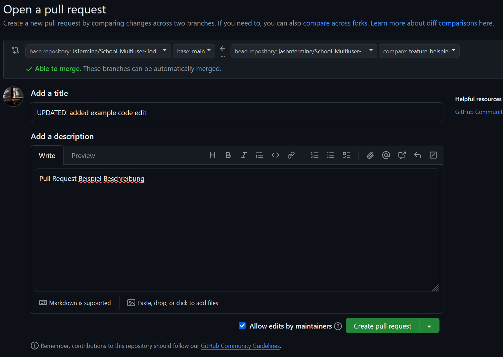

5. **Pull-Request überprüfen und mergen**
    #### Merge Commit
      _PS: Im Screenshot verwende / Logge ich mich in mein Persönliches Github, um den PR zu überprüfen und zu mergen._
    - Überprüfen Sie die vorgeschlagenen Änderungen.
    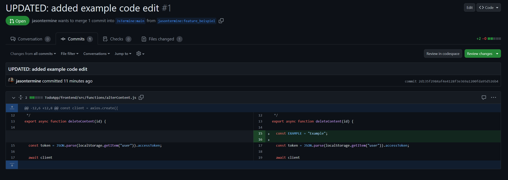
    - Diskutieren Sie eventuelle Änderungen oder Anmerkungen im PR-Kommentarbereich.
    - Wenn Sie mit den Änderungen zufrieden sind, können Sie den Pull-Request mergen.
    - Klicken Sie auf `"Merge pull request"` und wählen Sie die gewünschte Merge-Strategie.
    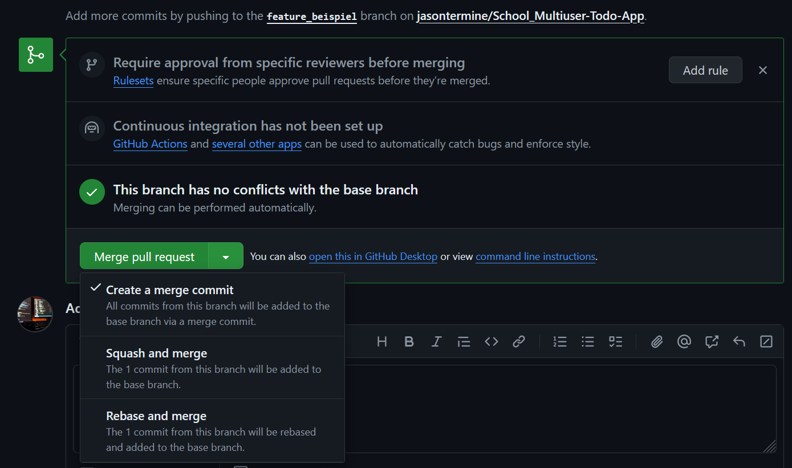
    - Der Pull-Request wurde erfolgreich gemerged.
    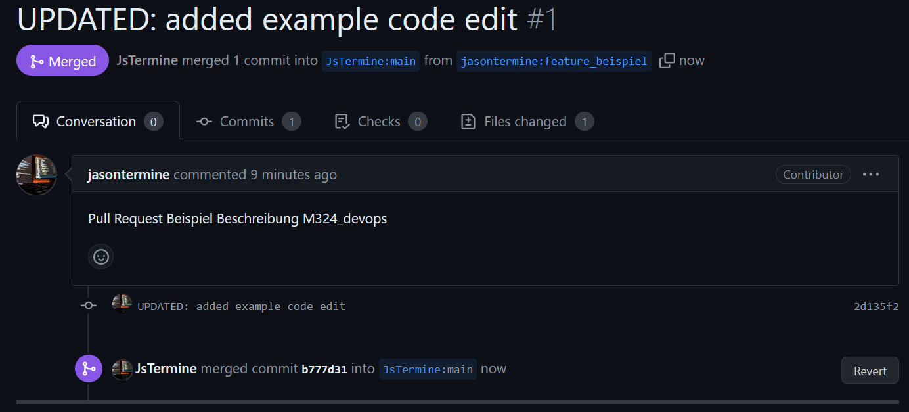
    - Der Branch `feature-beispiel` kann nun gelöscht werden.
    #### Squash and Merge
    - Folgen Sie den gleichen Schritten wie bei Merge Commit bis zum Punkt 4.
    - Wählen Sie die Merge-Strategie `"Squash and Merge"` und klicken Sie auf `"Confirm squash and merge"`.
    
    - Der Pull-Request wurde erfolgreich gemerged.
    
    - Im Vergleich zu Merge Commit wurde nur ein Commit hinzugefügt und die anderen Commits wurden in diesen einen Commit zusammengefasst.
    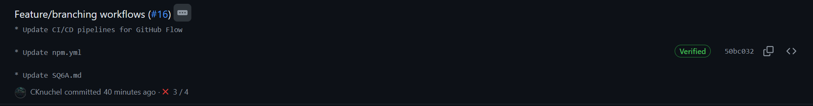
    #### Rebase and Merge
    - Folgen Sie die gleichen Schritte wie bei Merge Commit bis zum Punkt 4.
    - Für diese Strategie wurden 3 weitere Commits hinzugefügt, um die Unterschiede zu zeigen.
    
    - Wählen Sie die Merge-Strategie `"Rebase and Merge"` und klicken Sie auf `"Confirm rebase and merge"`.
    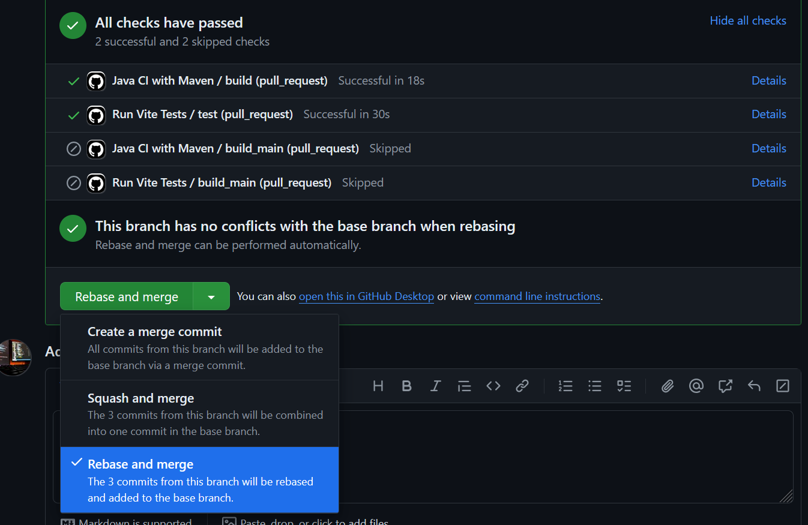
    - Der Pull-Request wurde erfolgreich gemerged.
    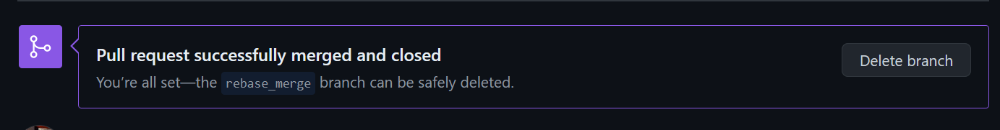
    - Im Vergleich zu Merge Commit und Squash and Merge wurden keine Merge-Commits hinzugefügt und die Commits wurden auf den Basisbranch rebased.
    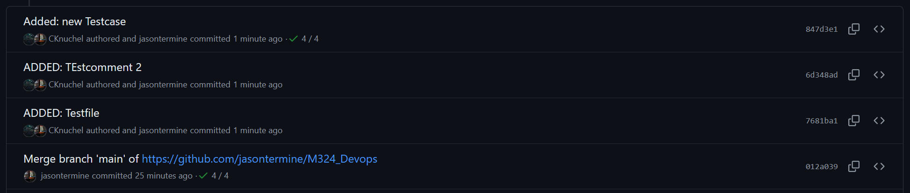

